# 🛒 E-Commerce Web Application

## 🔗 Live Demo

👉 https://ecommeraceproject.netlify.app/

## 📂 Repository

👉 https://github.com/MeladEssam/E-commerce

---

## 📌 Overview

A full-featured **E-Commerce web application** built using Angular with SSR and modern state management techniques.

The app provides a complete shopping experience including authentication, product browsing, cart management, and order handling with a clean and responsive UI.

---

## 🚀 Features

### 🔐 Authentication

- Login
- Register
- Forgot Password

### 🛍️ Shopping Experience

- Browse products
- Product details page
- Shop page
- Search functionality

### 🧾 Categories & Brands

- All categories page
- Brands page
- Sub-categories support

### 🛒 Cart & Wishlist

- Add to cart
- Manage cart
- Wishlist page

💳 Checkout & Orders

# Seamless checkout experience

# Multiple payment options:

💵 Cash on Delivery (COD)
💳 Online Payment (Simulated)

# Order placement and confirmation

# Orders history & tracking

### 👤 User Profile

- Profile settings
- Manage addresses

### 🏠 Other Pages

- Home page
- Not found page

### 🌐 Multi-language Support (i18n)

- Full support for Arabic and English languages
- Dynamic language switching without page reload
- RTL (Arabic) & LTR (English) layout handling
- Integrated translation system for scalable content management

---

## 🛠️ Tech Stack

- ⚛️ Angular (SSR + Signals)
- 🎨 Tailwind CSS
- 🧩 Component-based architecture
- 🔗 REST API integration
- 🌐 Netlify deployment
  🌍 i18n (Internationalization)

---

## 📁 Project Structure

```bash
src/app/
 ├── core/
 │   ├── auth/
 │   ├── guards/
 │   ├── interceptors/
 │   ├── services/
 │
 ├── features/
 │   ├── home/
 │   ├── shop/
 │   ├── product-details/
 │   ├── cart/
 │   ├── wishlist/
 │   ├── checkout/
 │   ├── orders/
 │   ├── profile/
 │   ├── categories/
 │   ├── brands/
 │   ├── search/
 │
 ├── shared/
 ├── home/
 │   ├── empty-state/
 │   ├── product-card/
 │   ├── footer/
 │   ├── navbar/
 │   ├── page-header/
 │   ├── section-title/
 │   ├── loading-spinner/

```

---

## ⚙️ Installation

```bash
# Clone the repository
git clone https://github.com/MeladEssam/E-commerce.git

# Navigate into project
cd E-commerce

# Install dependencies
npm install

# Run project
ng serve
```

---

## 📦 Build

```bash
ng build
```

---

## 🌍 Deployment

The project is deployed using **Netlify**:
👉 https://ecommeraceproject.netlify.app/

---

## 💡 Future Improvements

- 🧑‍💼 Admin dashboard
- 🔔 Notifications system

---

## 🙋‍♂️ Author

**Melad Essam**
Frontend Developer (Angular)

---

## ⭐ Support

If you like this project, give it a ⭐ on GitHub!

## 📸 Screenshots

<p align="center">
  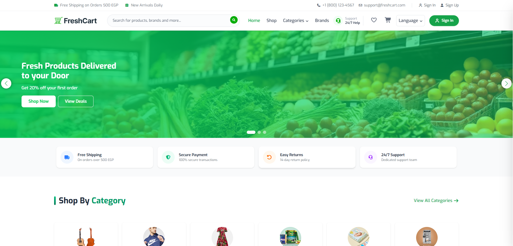
</p>

<p align="center">
  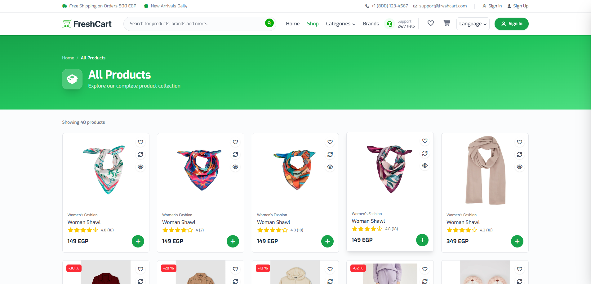
  
</p>

<p align="center">
  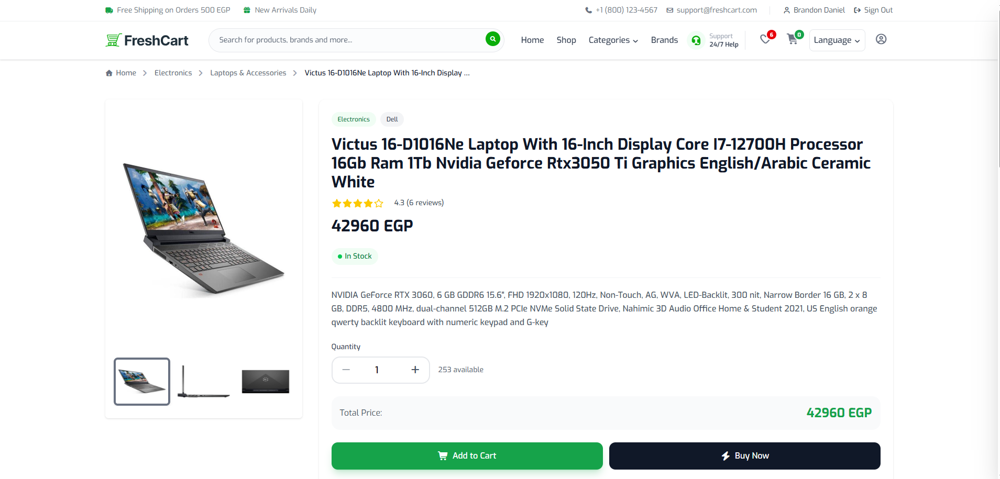
</p>

<p align="center">
  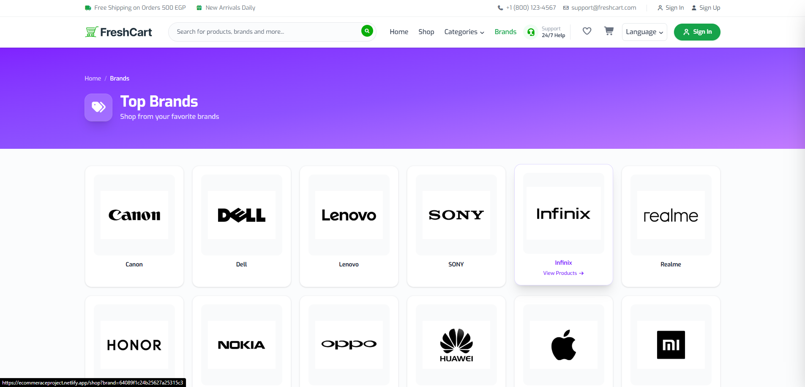
  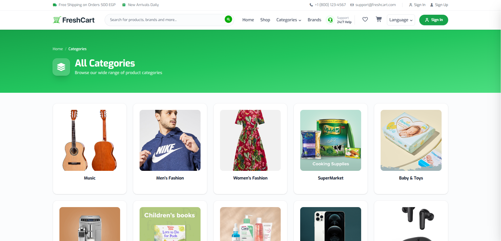
</p>

<p align="center">
  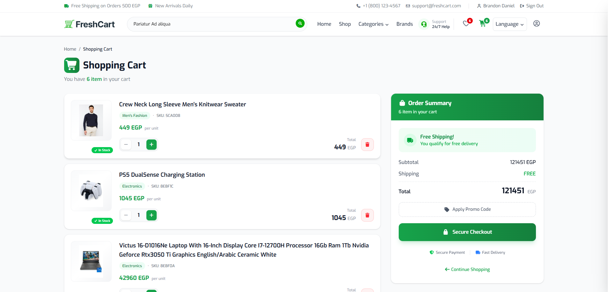
  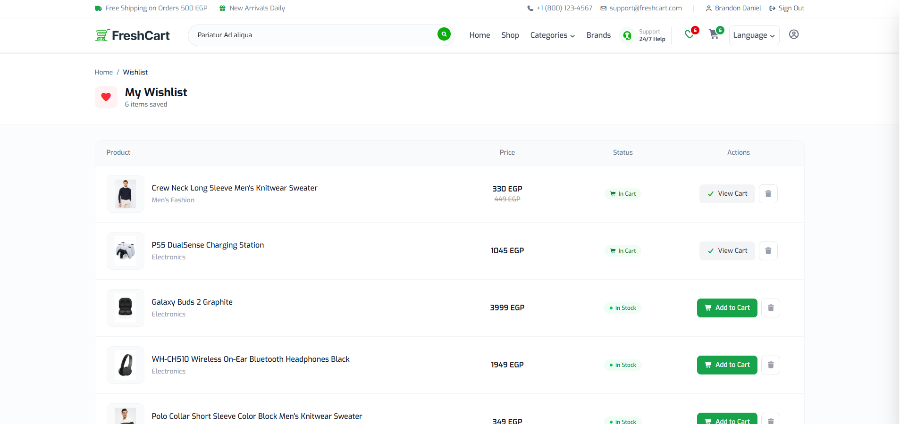
</p>

<p align="center">
  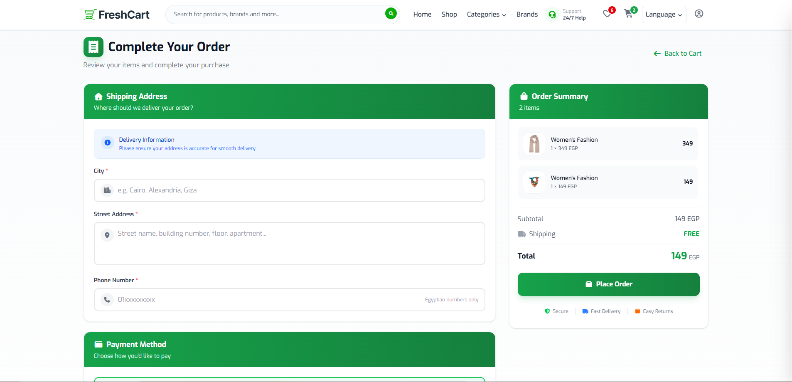
  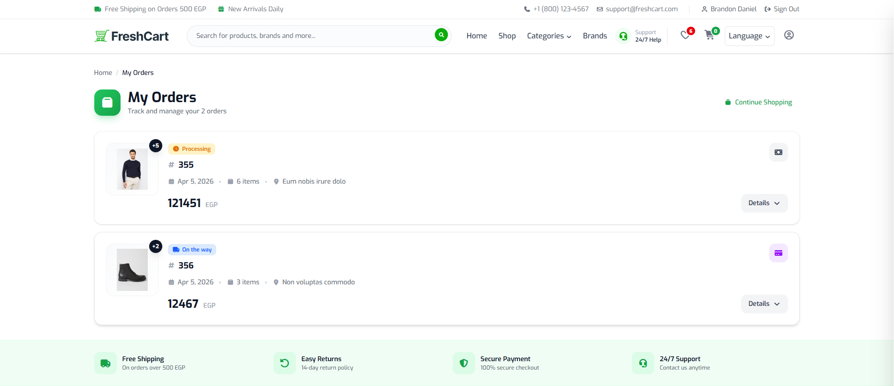
</p>

<p align="center">
  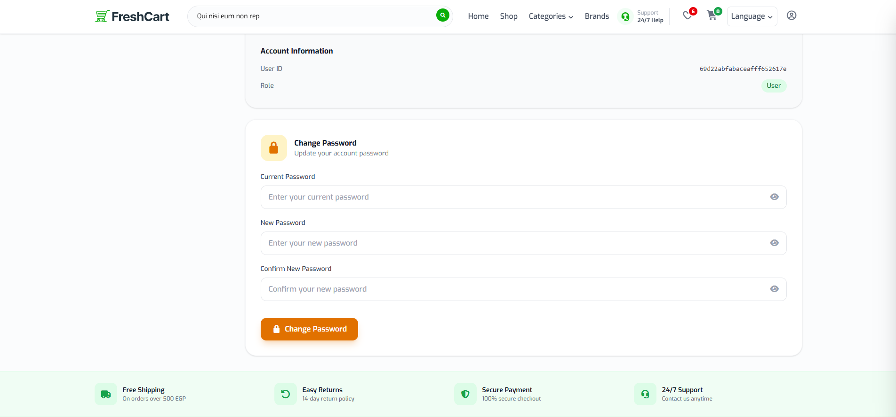
  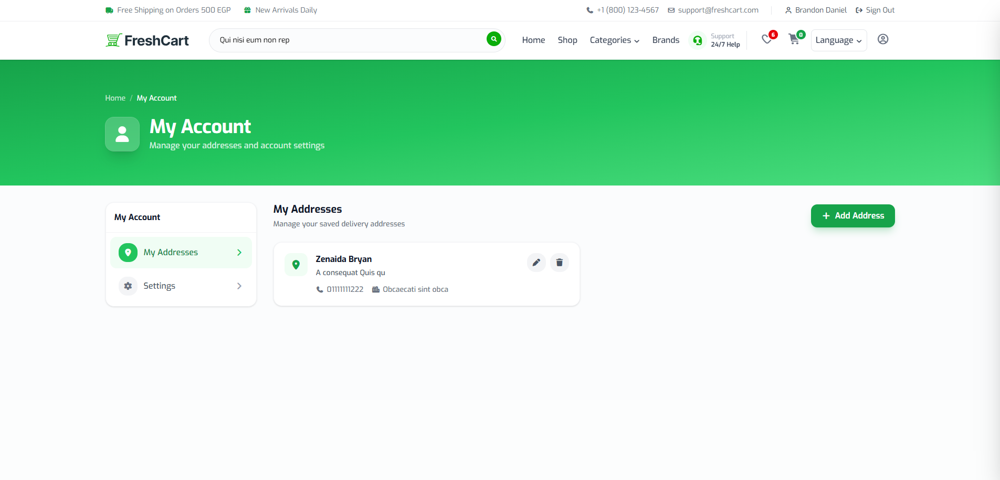
</p>

<p align="center">
  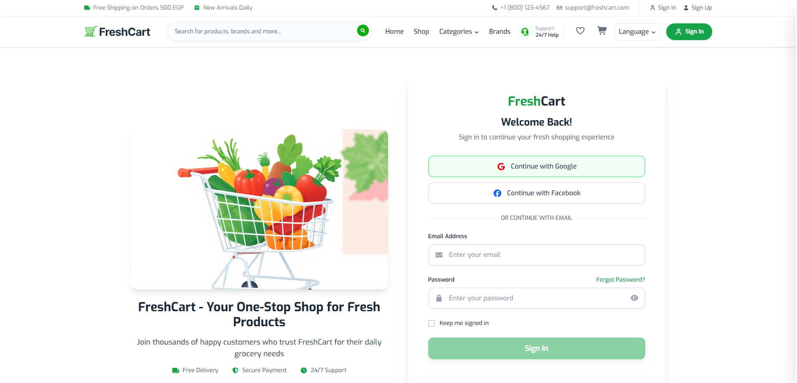
</p>
